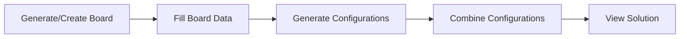

# Minesweeper Solver

A comprehensive set of tools to help players find the best next move in Minesweeper games by analyzing all possible valid configurations of the current board state.

## 🎯 Overview

This project provides a systematic approach to solving Minesweeper puzzles by:
1. Generating all possible valid mine configurations based on revealed cells
2. Combining configurations to identify cells that are definitely safe or definitely mines
3. Visualizing results to help players make informed decisions

## 📋 Table of Contents

- [How It Works](#how-it-works)
- [Board Notation](#board-notation)
- [Tools](#tools)
- [Workflow](#workflow)
- [Installation](#installation)
- [Usage Examples](#usage-examples)
- [Web Interface](#web-interface)

## 🔍 How It Works

The solver uses constraint satisfaction techniques to:

1. **Identify the outline**: Unknown cells adjacent to revealed numbers
2. **Split into clusters**: Independent groups of cells that don't share constraints
3. **Generate valid configurations**: Use backtracking with pruning to find all valid mine placements
4. **Combine results**: Identify cells that are the same across all configurations

### Algorithm Highlights

- **Cluster-based solving**: Dramatically reduces search space by solving independent regions separately
- **Smart pruning**: Eliminates invalid configurations early during backtracking
- **Memory efficient**: Writes configurations progressively instead of holding everything in memory

## 📝 Board Notation

### Input Symbols
- `.` - Unknown/unvisited cell
- `?` - Unknown (treated same as `.`)
- `!` - Flagged mine (known mine)
- `0-8` - Revealed number (count of adjacent mines)

### Output Symbols
- `o` - Safe cell (always safe in all configurations)
- `x` - Mine (always a mine in all configurations)
- `#` - Uncertain (varies across configurations)
- Numbers and flags remain unchanged

## 🛠️ Tools

### Python Scripts

#### 1. `generate_board.py`
Creates an empty board template filled with dots.

**Usage:**
```bash
python generate_board.py --width 10 --height 5
```

**Output:** `board_YYYYMMDD_HHMMSS.txt`

---

#### 2. `generate_configurations.py` (Optimized)
Generates all valid mine configurations using an optimized cluster-based algorithm.

**Features:**
- Splits outline into independent clusters
- Uses backtracking with strong pruning
- Safety threshold to prevent memory overflow (configurable)

**Usage:**
```bash
python generate_configurations.py board_20251231_120000.txt
```

**Output:** `configurations_20251231_120000.txt`

---

#### 3. `generate_configurations_brute_force.py`
Reference implementation using brute force enumeration.

**Note:** Kept for reference. Use the optimized version for better performance.

---

#### 4. `combine_configurations.py`
Analyzes all configurations and creates a solution board showing:
- Cells that are always safe (`o`)
- Cells that are always mines (`x`)
- Cells that vary (`#`)

**Usage:**
```bash
python combine_configurations.py configurations_20251231_120000.txt
```

**Output:** `solution_20251231_120000.txt`

---

#### 5. `pipeline.py`
Runs the complete workflow: configuration generation + combination.

**Usage:**
```bash
# Use specific board
python pipeline.py board_20251231_120000.txt

# Use latest board automatically
python pipeline.py --latest
```

---

#### 6. `board_viewer.py`
Displays boards in the console with emoji formatting.

**Usage:**
```bash
python board_viewer.py solution_20251231_120000.txt
```

**Emoji Legend:**
- `💣` - Mine (!)
- `👍` - Safe (o)
- `👎` - Unsafe/Mine (x)
- `❓` - Unknown (?)
- `🤔` - Uncertain (#)
- `𝟎-𝟗` - Numbers

### HTML Tools

#### 1. `minesweeper-editor.html`
Interactive board editor for creating and editing boards.

**Features:**
- Click and drag to draw
- Multiple pen tools (`.`, `?`, `!`, `0-8`)
- Real-time preview
- Download as text file with timestamp

---

#### 2. `minesweeper-viewer.html`
Visual board renderer for viewing boards in the browser.

**Features:**
- Color-coded cells
- Emoji representation
- Easy copy/paste of board data
- Renders all special symbols

## 📊 Workflow

### Standard Workflow



### Detailed Steps

1. **Create Board**
   - Option A: Use `generate_board.py` to create empty template, then edit manually
   - Option B: Use `minesweeper-editor.html` for visual editing

2. **Generate Configurations**
   ```bash
   python generate_configurations.py board_20251231_120000.txt
   ```

3. **Combine to Find Solution**
   ```bash
   python combine_configurations.py configurations_20251231_120000.txt
   ```

4. **View Results**
   - Console: `python board_viewer.py solution_20251231_120000.txt`
   - Browser: Open `minesweeper-viewer.html` and paste board

### Quick Workflow (Pipeline)

```bash
# Automatic pipeline
python pipeline.py board_20251231_120000.txt

# Or use latest board
python pipeline.py --latest
```

## 💻 Installation

### Prerequisites
- Python 3.7 or higher
- Modern web browser (for HTML tools)

### Setup

```bash
# Clone or download the repository
cd minesweeper_solver

# No additional dependencies required - uses Python standard library only!
```

## 📖 Usage Examples

### Example 1: Complete Workflow

```bash
# Step 1: Create a 10x10 board
python generate_board.py --width 10 --height 10

# Step 2: Edit board_YYYYMMDD_HHMMSS.txt manually or using minesweeper-editor.html

# Step 3: Run pipeline
python pipeline.py --latest

# Step 4: View result
python board_viewer.py solution_YYYYMMDD_HHMMSS.txt
```

### Example 2: Manual Process

```bash
# Generate configurations
python generate_configurations.py board_20251231_120000.txt
# Output: configurations_20251231_120000.txt

# Combine configurations
python combine_configurations.py configurations_20251231_120000.txt
# Output: solution_20251231_120000.txt

# View result
python board_viewer.py solution_20251231_120000.txt
```

### Example 3: Using HTML Editor

1. Open `minesweeper-editor.html` in a browser
2. Set dimensions (e.g., 10x10)
3. Select pen tool and draw your board state
4. Click "Download Board File"
5. Use the downloaded file with the pipeline:
   ```bash
   python pipeline.py board_YYYYMMDD_HHMMSS.txt
   ```

## 🌐 Web Interface

A unified web application (`minesweeper-solver.html`) is available that combines all functionality:

**Features:**
- Board creation and editing with Visual Grid Editor
- Upload/paste screenshots and convert them to boards
- One-click configuration generation and solving
- Probability calculations for uncertain cells
- Save and load game history with timeline view
- Export results
- Dark theme enabled by default
- No command-line required!

### Running the Web App

To avoid CORS issues, use the included server scripts instead of opening the HTML file directly:

```bash
# Option 1: Python script (recommended)
python3 serve.py

# Option 2: Bash script
./serve.sh

# Option 3: Custom port
python3 serve.py 3000
```

Then open your browser to: **http://localhost:8000/minesweeper-solver.html**

See `SERVER_GUIDE.md` for detailed instructions.

### Legacy Tools

- `minesweeper-editor.html` - Standalone board editor
- `minesweeper-viewer.html` - Standalone board viewer

**Note:** The unified webapp (`minesweeper-solver.html`) is recommended for the best experience.

## 📁 Archive

The `archive/` folder contains previous runs for testing and reference:
- `board_*.txt` - Input boards
- `configurations_*.txt` - Generated configurations
- `solution_*.txt` - Combined solution boards

## 🔧 Advanced Configuration

### Maximum Configurations Limit

In `generate_configurations.py`, you can adjust the safety threshold:

```python
MAX_COMBINATIONS_WARN = 10_000_000  # Adjust this value
```

This prevents memory overflow when the number of configurations becomes astronomical.

## 🤝 Contributing

Suggestions and improvements are welcome! Consider:
- Performance optimizations
- Additional visualization options
- Better heuristics for configuration generation
- UI/UX improvements

## 📄 License

This project is open source. Feel free to use and modify as needed.

## 🙏 Acknowledgments

Built to help Minesweeper players make informed decisions using computational analysis.

---

**Happy Minesweeping! 💣🎮**

